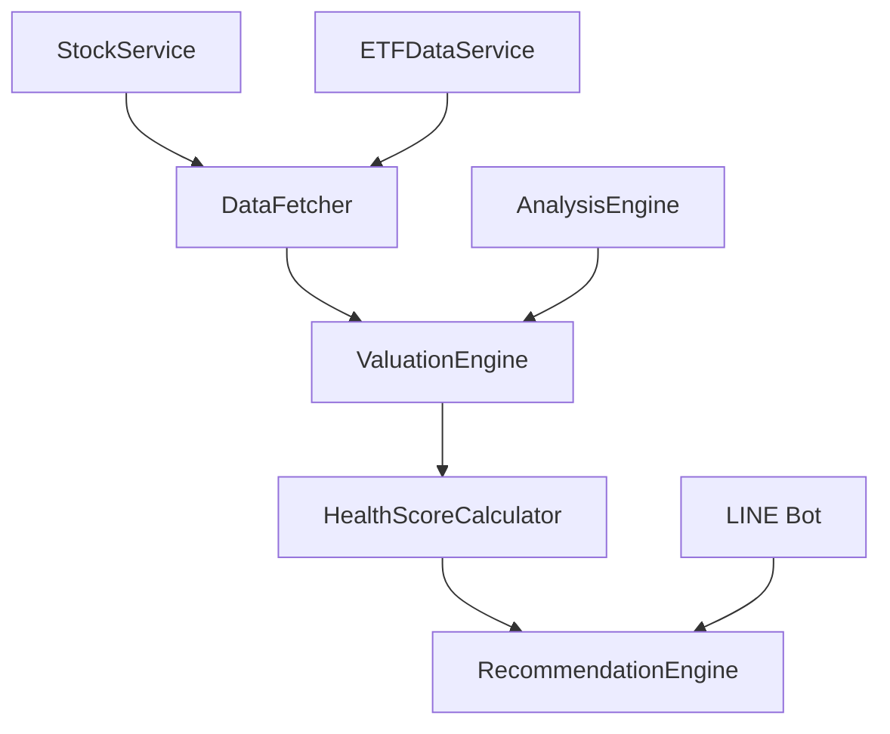

# Design Document

## Overview

股票體質分析系統是股健檢的核心功能模組，整合多個資料來源（Yahoo財經、TradingView、公開資訊觀測站等），運用PE Band、DCF、DDM等專業估值方法，為投資者提供準確的股票健康度評估、合理價位計算和進場建議。系統採用模組化架構，與現有的分析引擎和服務層無縫整合，提供可擴展且易於維護的解決方案。

## Steering Document Alignment

### Technical Standards (tech.md)
- **MVC架構模式**：遵循專案既定的Model-View-Controller架構，新增的估值引擎作為服務層組件
- **Node.js 24 LTS**：使用最新的Node.js版本，確保效能和安全性
- **TypeScript支援**：所有新組件使用TypeScript開發，提供型別安全
- **Firebase Functions**：整合現有的Serverless架構，支援可擴展部署
- **模組化設計**：遵循專案的模組化原則，每個組件專注於單一職責

### Project Structure (structure.md)
- **目錄組織**：新增的估值相關組件放置在`functions/src/engines/`和`functions/src/services/`目錄
- **命名規範**：遵循專案的camelCase命名慣例，類別使用PascalCase
- **匯入模式**：按照專案標準的匯入順序組織依賴關係
- **檔案大小指南**：每個檔案控制在500行以內，函數控制在50行以內

## Code Reuse Analysis

### Existing Components to Leverage
- **StockService**: 擴展現有的股票資料取得功能，整合新的估值引擎
- **ETFDataService**: 重用ETF資料處理邏輯，加入殖利率估值計算
- **AnalysisEngine**: 整合現有的分析引擎架構，新增估值分析類型
- **StockDataAdapter**: 重用資料適配器模式，支援多資料來源整合
- **types/stock.ts**: 擴展現有的型別定義，新增估值相關介面

### Integration Points
- **Firebase Functions**: 透過現有的Serverless架構部署新功能
- **LINE Bot API**: 整合現有的LINE Bot控制器，提供估值分析服務
- **Firestore**: 利用現有的資料庫架構儲存估值結果和歷史記錄
- **快取系統**: 整合現有的快取機制，提升估值查詢效能

## Architecture

### Modular Design Principles
- **Single File Responsibility**: 每個檔案專注於單一功能（資料取得、估值計算、評分系統）
- **Component Isolation**: 建立小型、專注的組件，避免大型單體檔案
- **Service Layer Separation**: 分離資料存取、業務邏輯和展示層
- **Utility Modularity**: 將工具函數分解為專注、單一用途的模組



## Components and Interfaces

### DataFetcher Component
- **Purpose:** 整合多個資料來源，提供統一的資料存取介面
- **Interfaces:** 
  - `fetchStockData(symbol: string): Promise<StockData>`
  - `fetchETFData(symbol: string): Promise<ETFData>`
  - `validateDataQuality(data: StockData): ValidationResult`
- **Dependencies:** Yahoo Finance API、TradingView API、公開資訊觀測站API
- **Reuses:** 現有的StockDataAdapter和ETFDataAdapter

### ValuationEngine Component
- **Purpose:** 執行PE Band、DCF、DDM等估值計算
- **Interfaces:**
  - `valuateStock(input: ValuationInput): Promise<ValuationResult>`
  - `valuateETF(input: ETFValuationInput): Promise<ETFValuationResult>`
  - `calculatePEBand(eps: number, peRange: PERange): MethodFair`
- **Dependencies:** 財務資料、市場假設參數
- **Reuses:** 現有的AnalysisEngine架構

### HealthScoreCalculator Component
- **Purpose:** 綜合多項指標計算0-100分的體質評分
- **Interfaces:**
  - `calculateHealthScore(data: ValuationResult): number`
  - `getScoreBreakdown(data: ValuationResult): ScoreBreakdown`
  - `generateHealthReport(data: ValuationResult): HealthReport`
- **Dependencies:** 估值結果、技術指標、基本面數據
- **Reuses:** 現有的AnalysisResult介面

### RecommendationEngine Component
- **Purpose:** 基於估值結果和體質評分提供進場建議
- **Interfaces:**
  - `generateRecommendation(data: ValuationResult): Recommendation`
  - `calculateEntryPrice(data: ValuationResult): EntryPrice`
  - `getRiskAssessment(data: ValuationResult): RiskAssessment`
- **Dependencies:** 體質評分、市場條件、風險偏好
- **Reuses:** 現有的Recommendation型別

## Data Models

### ValuationInput Model
```typescript
export interface ValuationInput {
  price: number;
  financials: Financials;
  epsCagr?: number;
  fcfCagr?: number;
  discountRate?: number;
  terminalGrowth?: number;
  peLow?: number;
  peHigh?: number;
  dividendGrowth?: number;
  ddmDiscountRate?: number;
  marginOfSafety?: number;
}

export interface Financials {
  epsTtm?: number;
  epsForward1y?: number;
  fcfPerShare?: number;
  dividendPerShare?: number;
  netDebtPerShare?: number;
}
```

### ValuationResult Model
```typescript
export interface ValuationResult {
  price: number;
  methods: MethodFair[];
  compositeFair?: { low?: number; mid?: number; high?: number };
  signal: "CHEAP" | "FAIR" | "EXPENSIVE";
  suggestedBuyPrice?: number;
  notes: string[];
  healthScore: number;
  timestamp: Date;
}

export interface MethodFair {
  method: "PE" | "DCF" | "DDM";
  fairLow?: number;
  fairMid?: number;
  fairHigh?: number;
  confidence: number;
}
```

### HealthReport Model
```typescript
export interface HealthReport {
  symbol: string;
  overallScore: number;
  categoryScores: {
    valuation: number;
    fundamentals: number;
    technical: number;
    risk: number;
  };
  recommendations: string[];
  riskFactors: RiskFactor[];
  lastUpdated: Date;
}
```

## Error Handling

### Error Scenarios
1. **資料來源失敗**: 當主要資料來源無法取得資料時
   - **Handling:** 自動切換至備用資料來源，記錄錯誤日誌
   - **User Impact:** 顯示警告訊息，但繼續提供基於可用資料的分析

2. **資料品質問題**: 當取得資料不一致或異常時
   - **Handling:** 執行資料驗證，標示資料品質等級，提供置信度評分
   - **User Impact:** 在分析結果中標示資料品質警告

3. **估值計算錯誤**: 當必要參數缺失或計算失敗時
   - **Handling:** 使用預設參數或跳過該估值方法，記錄錯誤
   - **User Impact:** 顯示部分分析結果，說明哪些方法無法執行

4. **API限制**: 當外部API達到呼叫限制時
   - **Handling:** 實作速率限制和重試機制，使用快取資料
   - **User Impact:** 顯示快取資料的更新時間，建議稍後重試

## Testing Strategy

### Unit Testing
- 針對每個估值方法（PE Band、DCF、DDM）建立獨立測試
- 測試資料品質驗證邏輯和錯誤處理機制
- 驗證體質評分計算的準確性和一致性

### Integration Testing
- 測試多資料來源的整合和故障轉移機制
- 驗證估值引擎與現有分析系統的整合
- 測試快取機制和資料持久化功能

### End-to-End Testing
- 模擬完整的股票分析流程，從資料取得到建議生成
- 測試不同市場條件下的分析結果一致性
- 驗證LINE Bot介面的回應時間和用戶體驗