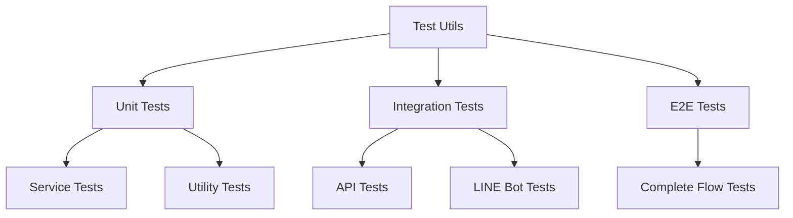

# Design Document

## Overview

建立完整的測試框架，涵蓋單元測試、整合測試和端到端測試，確保股健檢專案的程式碼品質和功能穩定性。測試框架將整合到現有的 CI/CD 流程中，支援自動化測試執行和品質檢查。

## Steering Document Alignment

### Technical Standards (tech.md)
- 遵循 Node.js 24 和 TypeScript 技術棧
- 使用 Jest 作為主要測試框架，符合 JavaScript 生態系統標準
- 整合 ESLint 和 Prettier 確保程式碼品質
- 採用 MVC 架構模式，測試各層級的分離關注點

### Project Structure (structure.md)
- 測試檔案遵循 `[filename].test.ts` 命名規範
- 測試目錄結構與源碼目錄結構保持一致
- 使用相對路徑匯入，遵循專案的模組組織原則
- 測試工具和輔助函數放在 `__tests__` 目錄中

## Code Reuse Analysis

### Existing Components to Leverage
- **scripts/test/**: 現有的手動測試腳本可作為整合測試的基礎
- **functions/src/services/**: 服務層模組可直接進行單元測試
- **functions/src/utils/**: 工具函數適合單元測試驗證
- **functions/src/controllers/**: 控制器層需要整合測試驗證

### Integration Points
- **Firebase Functions**: 測試環境需要模擬 Firebase 服務
- **LINE Bot SDK**: 需要模擬 LINE Messaging API 回應
- **Yahoo Finance API**: 使用模擬數據避免依賴外部服務
- **Express.js**: 測試 HTTP 端點和中介軟體

## Architecture

### Modular Design Principles
- **Single File Responsibility**: 每個測試檔案專注於測試單一功能模組
- **Component Isolation**: 測試工具和輔助函數獨立模組化
- **Service Layer Separation**: 分別測試服務層、控制器層和工具層
- **Utility Modularity**: 測試輔助函數分離為可重複使用模組



## Components and Interfaces

### Jest Test Framework
- **Purpose:** 提供完整的測試執行環境和斷言庫
- **Interfaces:** `describe()`, `it()`, `expect()`, `beforeEach()`, `afterEach()`
- **Dependencies:** TypeScript, Node.js 24
- **Reuses:** 現有的 npm scripts 和 package.json 配置

### Test Utilities Module
- **Purpose:** 提供測試輔助函數和模擬數據
- **Interfaces:** `createMockStockData()`, `createMockLineEvent()`, `setupTestEnvironment()`
- **Dependencies:** Jest, Firebase Admin SDK
- **Reuses:** 現有的類型定義和配置檔案

### Mock Services
- **Purpose:** 模擬外部服務和 API 回應
- **Interfaces:** `MockYahooFinanceAPI`, `MockLineBotAPI`, `MockFirebaseAdmin`
- **Dependencies:** Jest mocks
- **Reuses:** 現有的服務介面和類型定義

### Test Configuration
- **Purpose:** 管理測試環境配置和設定
- **Interfaces:** `jest.config.js`, `test-setup.ts`, `.env.test`
- **Dependencies:** Jest, dotenv
- **Reuses:** 現有的環境變數和配置模式

## Data Models

### TestStockData
```
interface TestStockData {
  symbol: string;
  name: string;
  price: number;
  change: number;
  changePercent: number;
  volume: number;
  marketCap: number;
  pe: number;
  pb: number;
  dividendYield: number;
}
```

### TestLineEvent
```
interface TestLineEvent {
  type: 'message';
  message: {
    type: 'text';
    text: string;
  };
  replyToken: string;
  source: {
    userId: string;
    type: 'user';
  };
}
```

### TestEnvironment
```
interface TestEnvironment {
  firebaseProjectId: string;
  lineChannelAccessToken: string;
  lineChannelSecret: string;
  yahooFinanceApiKey: string;
  testUserId: string;
}
```

## Error Handling

### Error Scenarios
1. **測試環境配置錯誤**
   - **Handling:** 在測試開始前驗證環境變數和配置
   - **User Impact:** 測試失敗並提供詳細的配置錯誤訊息

2. **外部 API 模擬失敗**
   - **Handling:** 使用 Jest 的 mock 機制確保模擬服務正常工作
   - **User Impact:** 測試失敗並顯示模擬服務錯誤

3. **測試數據不一致**
   - **Handling:** 使用工廠函數生成一致的測試數據
   - **User Impact:** 測試結果可重複且可靠

4. **Firebase 服務模擬問題**
   - **Handling:** 使用 Firebase Emulator Suite 或 Jest mocks
   - **User Impact:** 測試在隔離環境中執行，不影響生產數據

## Testing Strategy

### Unit Testing
- 使用 Jest 作為測試框架，支援 TypeScript
- 測試覆蓋率目標：80% 以上
- 重點測試服務層的業務邏輯和工具函數
- 使用 `jest.fn()` 模擬依賴項

### Integration Testing
- 測試 API 端點和 LINE Bot 回應
- 使用 supertest 測試 Express.js 應用程式
- 模擬外部服務但保持真實的內部流程
- 測試錯誤處理和邊界情況

### End-to-End Testing
- 測試完整的用戶流程，從 LINE 訊息到回應
- 使用 Playwright 或 Puppeteer 進行瀏覽器測試（未來擴展）
- 測試實際的 Firebase Functions 部署
- 驗證 Flex Message 格式和內容正確性