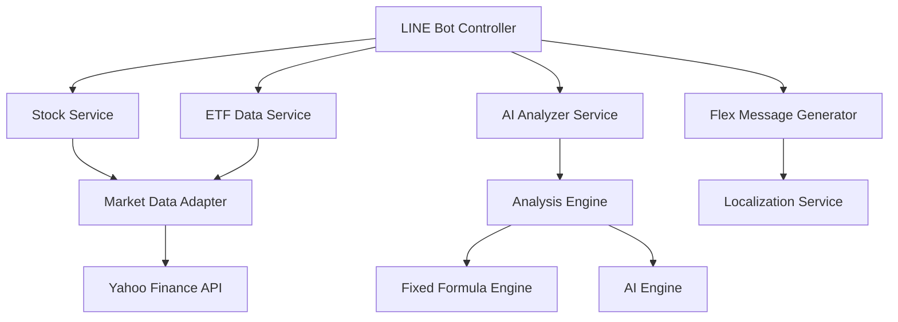

# 設計文件

## 概覽

TypeScript 遷移專案將採用一次性轉換策略，將整個股健檢 LINE Bot 系統從 JavaScript 轉換為 TypeScript。此設計將建立可擴展的類型系統，支援多語系、多市場和可插拔分析引擎，同時保持嚴格的類型檢查和現代化的開發體驗。

## 與專案導向文件的一致性

### 技術標準 (tech.md)
- 遵循 Node.js 24 和 Firebase Functions 6.4+ 技術棧
- 採用 MVC 架構模式，保持清晰的層級分離
- 使用 ESLint 和 Prettier 確保程式碼品質
- 整合 Firebase Firestore 作為主要數據儲存

### 專案結構 (structure.md)
- 遵循單一職責原則，每個檔案有明確目的
- 採用模組化設計，組件隔離且可重複使用
- 建立清晰的依賴管理，最小化模組間耦合
- 遵循 camelCase 命名規範和 TypeScript 最佳實踐

## 程式碼重用分析

### 現有組件重用
- **stockService.js**: 轉換為 TypeScript 並擴展多市場支援
- **aiAnalyzer.js**: 轉換為 TypeScript 並建立可插拔分析引擎
- **etfDataService.js**: 轉換為 TypeScript 並整合多市場數據
- **lineController.js**: 轉換為 TypeScript 並增強 Flex Message 系統
- **webhookController.js**: 轉換為 TypeScript 並改善事件處理

### 整合點
- **Firebase Functions**: 保持現有部署流程，增加 TypeScript 編譯步驟
- **LINE Messaging API**: 增強類型安全的事件處理和回應生成
- **Yahoo Finance API**: 建立強類型的數據獲取和處理介面

## 架構

### 模組化設計原則
- **單一檔案職責**: 每個檔案處理特定領域或關注點
- **組件隔離**: 建立小型、專注的組件而非大型單體檔案
- **服務層分離**: 分離數據存取、業務邏輯和表現層
- **工具模組化**: 將工具分解為專注、單一目的的模組



## 組件和介面

### TypeScript 配置組件
- **目的**: 管理 TypeScript 編譯配置和建置流程
- **介面**: `tsconfig.json`, 建置腳本, 開發工具配置
- **依賴**: Node.js, TypeScript 編譯器
- **重用**: 現有的 npm 腳本和 CI/CD 流程

### 核心類型定義組件
- **目的**: 定義所有核心數據類型和介面
- **介面**: `types/stock.ts`, `types/line.ts`, `types/analysis.ts`
- **依賴**: TypeScript 編譯器
- **重用**: 現有的數據結構和 API 回應格式

### 多市場數據適配器組件
- **目的**: 統一處理不同市場的數據格式和 API
- **介面**: `MarketDataAdapter`, `StockDataAdapter`, `ETFDataAdapter`
- **依賴**: 外部 API 服務, 核心類型定義
- **重用**: 現有的 Yahoo Finance API 整合

### 可插拔分析引擎組件
- **目的**: 支援固定公式和 AI 驅動的分析算法
- **介面**: `AnalysisEngine`, `FixedFormulaEngine`, `AIEngine`
- **依賴**: 分析算法, 數據處理服務
- **重用**: 現有的分析邏輯和 AI 整合

### 多語系服務組件
- **目的**: 管理多語系文字和本地化
- **介面**: `LocalizationService`, `MessageTranslator`
- **依賴**: 語言資源檔案, 用戶偏好設定
- **重用**: 現有的錯誤訊息和用戶介面文字

### Flex Message 生成器組件
- **目的**: 動態生成美觀且互動的 LINE 訊息
- **介面**: `FlexMessageGenerator`, `ComponentFactory`
- **依賴**: LINE Bot SDK, 多語系服務
- **重用**: 現有的 Flex Message 模板和佈局

## 數據模型

### 股票數據模型
```typescript
interface StockData {
  symbol: string;
  name: string;
  price: number;
  change: number;
  changePercent: number;
  volume: number;
  marketCap?: number;
  pe?: number;
  dividendYield?: number;
  marketType: MarketType;
  lastUpdated: Date;
}

enum MarketType {
  TW_STOCK = 'TW_STOCK',
  ETF = 'ETF',
  US_STOCK = 'US_STOCK',
  CRYPTO = 'CRYPTO'
}
```

### 分析結果模型
```typescript
interface AnalysisResult {
  symbol: string;
  healthScore: number;
  technicalScore: number;
  fundamentalScore: number;
  riskScore: number;
  recommendations: Recommendation[];
  analysisType: AnalysisType;
  timestamp: Date;
}

enum AnalysisType {
  FIXED_FORMULA = 'FIXED_FORMULA',
  AI_DRIVEN = 'AI_DRIVEN'
}

interface Recommendation {
  type: 'BUY' | 'HOLD' | 'SELL';
  reason: string;
  confidence: number;
}
```

### 多語系訊息模型
```typescript
interface LocalizedMessage {
  zh_TW: string;
  en_US: string;
  ja_JP: string;
}

interface UserPreferences {
  userId: string;
  language: 'zh_TW' | 'en_US' | 'ja_JP';
  marketTypes: MarketType[];
  analysisPreferences: AnalysisPreferences;
}
```

### LINE 事件模型
```typescript
interface StockQueryEvent extends MessageEvent {
  message: TextEventMessage & {
    text: string;
  };
  user: User;
}

interface AnalysisRequest {
  symbols: string[];
  analysisType: AnalysisType;
  includeRecommendations: boolean;
}
```

## 錯誤處理

### 錯誤情境
1. **TypeScript 編譯錯誤**
   - **處理**: 在建置階段捕獲並阻止部署
   - **用戶影響**: 開發者收到詳細的編譯錯誤訊息

2. **類型檢查失敗**
   - **處理**: 在開發階段即時顯示類型錯誤
   - **用戶影響**: IDE 提供即時錯誤提示和修正建議

3. **API 回應類型不匹配**
   - **處理**: 使用類型守衛和錯誤邊界處理
   - **用戶影響**: 優雅的錯誤訊息和回退機制

4. **多語系文字缺失**
   - **處理**: 回退到預設語言並記錄缺失
   - **用戶影響**: 顯示預設語言文字並標記為待翻譯

5. **市場數據獲取失敗**
   - **處理**: 重試機制和錯誤快取
   - **用戶影響**: 顯示錯誤訊息和建議重試

## 測試策略

### 單元測試
- **TypeScript 類型檢查**: 確保所有類型定義正確
- **核心服務測試**: 測試股票分析、AI 引擎、數據適配器
- **工具函數測試**: 測試多語系、Flex Message 生成器
- **錯誤處理測試**: 測試各種錯誤情境的處理

### 整合測試
- **API 整合測試**: 測試與 Yahoo Finance API 的整合
- **LINE Bot 整合測試**: 測試訊息處理和回應生成
- **多市場數據測試**: 測試不同市場的數據處理流程
- **分析引擎整合測試**: 測試固定公式和 AI 引擎的切換

### 端到端測試
- **完整用戶流程測試**: 從用戶輸入到分析結果顯示
- **多語系流程測試**: 測試不同語言的完整流程
- **多市場流程測試**: 測試不同市場的分析流程
- **錯誤恢復測試**: 測試系統在錯誤後的恢復能力