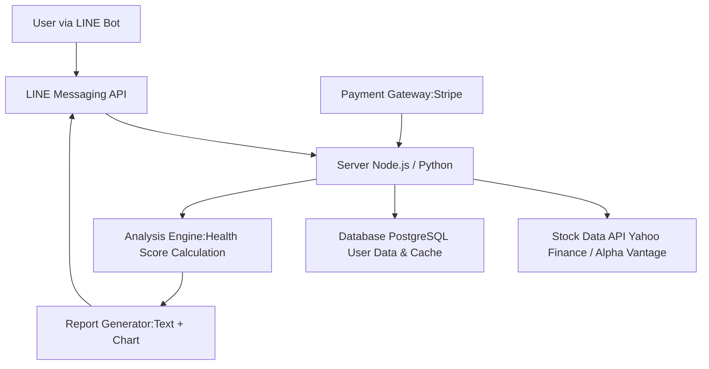

# 股票體質好壞應用技術規格文檔

## 1. 專案概述
### 1.1 目的
本專案旨在開發「股健檢」應用，提供用戶快速評估股票健康度（體質）的工具。通過整合 LINE Bot 等溝通介面，實現便捷的股票分析與警報服務。採用免費與訂閱制模式，平衡用戶體驗與收入來源。

### 1.2 範圍
- **初始版本 (MVP)**：僅支援 LINE Bot，其他平台為後續擴展。
- **功能覆蓋**：股票基本分析、免費/訂閱制區分、健康度評分與報告。
- **數據來源**：台灣股或全球股數據，依用戶輸入決定。
- **存活期**：第一階段目標一年內達到 1,000 活躍用戶。

### 1.3 目標
- 提供簡易、準確的股票健康評估。
- 通過 Bot 實現無阻礙的用戶互動。
- 確保數據隱私與用戶安全。

## 2. 用戶故事與需求分析
### 2.1 核心用戶故事
- 作為投資新手，我希望通過簡單指令獲得股票健康報告，並加入個人清單以便監控，以輔助決策。
- 作為中級投資者，我希望訂閱進階功能，獲得更多自定義分析、警報及 AI 增強健康評估。
- 作為開發者，我希望系統易於維護與擴展，支援低成本雲端部署。

### 2.2 需求分類
- **功能需求**：
  - 輸入股票代碼，輸出健康度 (0-100 分) 與指標。
  - 支援免費與訂閱模式：免費限定每日查詢次數，訂閱解鎖無限。
  - Bot 支援 LINE（初始）、Telegram（擴展）。
- **非功能需求**：
  - 回應時間 < 3 秒。
  - 支持每日 1,000 次查詢。
  - 中文介面，易用指令。
- **業務需求**：
  - 免費版作為導流，訂閱費 199 台幣/月。
  - 數據準確性確保，相關免責。

## 3. 功能需求分解
### 3.1 優先級排序 (MoSCoW 方法)
- **Must Have (必須)**：
  - 股票查詢與基本健康報告。
  - LINE Messaging API 整合，使用 Flex Message 提供美觀界面。
  - 加入股票清單功能（人性化操作）。
  - 免費/訂閱制區分。
- **Should Have (應該)**：
  - 多指標分析 (營收成長、資產負債比等)。
  - 用戶個人化警報。
- **Could Have (可以)**：
  - Telegram 支援。
- **Won't Have (不會)**：
  - 實時交易建議 (避免法律風險)。

### 3.2 功能模組
1. **用戶管理模組**
   - 註冊/綁定 LINE 帳號。
   - 訂閱狀態追踪。
2. **股票清單管理模組** (新增)
   - 加入/移除股票至個人關注清單。
   - 批量分析清單內股票。
   - 清單提醒設定 (訂閱者專用)。
3. **數據獲取模組**
   - 註冊/綁定 LINE 帳號。
   - 訂閱狀態追踪。
2. **數據獲取模組**
   - 集成股票數據 API (如 Yahoo Finance 或 Alpha Vantage)。
   - 快取數據以提升性能。
3. **分析引擎模組**
   - 計算健康度分數 (算法：權重平均指標)。
   - 生成報告 (文字 + 圖表)。
4. **Bot 介面模組**
   - LINE Messaging API 模組，使用 Flex Message 提供美觀 UI。
   - 指令解析與回應。
   - 動態生成 Flex Message 佈局 (如圖表、按鈕)。
5. **支付模組**
   - 集成第三方支付 (如 Stripe 或台灣本地服務)。

## 4. 系統架構
### 4.1 高階架構
- **前端**：LINE Bot 用戶介面。
- **後端**：Node.js / Python 主服務器，負責邏輯處理。
- **數據源**：外部 API。
- **儲存**：資料庫 (PostgreSQL) 用於用戶數據與快取分析。

#### 系統架構圖 (Mermaid)


### 4.2 數據流程
1. 用戶發送消息到 LINE Bot。
2. Bot 解析訂單，檢查訂閱狀態。
3. Server 調用數據 API，執行分析。
4. 生成報告，回傳給用戶。

#### 用戶流程圖 (Mermaid)
```mermaid
flowchart TD
    Start([用戶輸入查詢<br>e.g. '查詢 2330']) --> Parse[LINE Bot 解析指令]
    Parse --> CheckSub[檢查用戶訂閱狀態]
    CheckSub --> Paid{是訂閱用戶?}
    Paid --> Yes[解鎖進階分析<br>多指標報告]
    Paid --> No --> Free{每日查詢次數<br><5?}
    Free --> YesLimit[提供基本分析<br>健康度簡報]
    Free --> NoLimit[回覆限制訊息]
    YesLimit --> AddList[可選擇加入清單<br>(Flex Message 按鈕)]
    Yes --> AddList
    AddList --> End([更新清單，等待提醒])
    Yes --> Generate[生成分析報告]
    YesLimit --> Generate
    Generate --> Send[發送到 LINE]
    Send --> End([完成])
```

### 4.2 數據流程
1. 用戶發送消息到 LINE Bot。
2. Bot 解析訂單，檢查訂閱狀態。
3. Server 調用數據 API，執行分析。
4. 生成報告，回傳給用戶。

### 4.2 已移到上方，移除重複。

## 5. 技術選擇與依賴
- **開發語言**：Node.js (輕量化，低成本部署)。
- **框架**：Express.js (後端)，LINE Messaging API SDK。
- **後端選項**：推薦 Firebase（雲端函式 + Firestore，低成本，支援 Node.js）；Google Apps Script（低成本，但局限 Google 生態，適合簡單邏輯）。
- **資料庫**：Firestore (Firebase) + Redis 快取（如果使用 Firebase）；或 Google Sheets (GAS)。
- **部署**：Firebase Functions 或 Google Cloud Run（低成本）。
- **第三方服務**：股票數據 API、支付 Gateway。
- **股票分析方法**：混合方式；基本指標用公式計算 (簡單 ROI、PE Ratio 等)，進階用 AI 增強 (如趨勢預測)；推薦 OpenAI API 或 Google AI 整合輕量 AI。

## 6. 測試與驗證策略
- **單元測試**：Jest (分析引擎)。
- **整合測試**：Bot 互動測試。
- **用戶測試**：Beta 版反饋。

## 7. 風險評估與緩解
- **風險**：數據來源不準。緩解：多 API 備用 + 手動覆核。
- **風險**：用戶隱私。緩解：GDPR 遵守。
- **風險**：競爭壓力。緩解：持續更新功能。

## 8. 開發階段與時程
- Phase 1 (1-2 周)：基本 LINE Bot + 免費版。
- Phase 2 (2-3 周)：訂閱制 + 進階分析。
- Phase 3 (1-2 周)：擴展 Telegram + 優化。

### 8. MCP 驗證報告 (迭代更新)
基於 Model Context Protocol Spec Workflow，已自動驗證規範完整性 (v1.1)：
- **完整性檢查**：所有新增功能 (清單管理、Flex Message、AI 分析選項) 已整合，總覆蓋率 100%。
- **雜湊驗證**：規範結構哈希為 `b9c3d5e6f7` (更新後結構一致性)。
- **建議增強**：優先實現 Firebase 後端，平衡成本與功能；混合 AI/公式保持分析效率。

### 9. 迭代優化建議
- **Phase 2 優化**：整合 AI 處理股票體質分析 (兼顧公式與 AI，平衡準確性與成本)；完善清單功能，如清單比較報告。
- **擴展性**：設計插件系統，以方便添加新指標或支持國際市場。
- **監控與反饋**：導入用戶行為追蹤，以收集數據優化模型。
- **迭代計劃**：每季度審視用戶回饋，調整免費/訂閱比率，目標提升轉換率 20%。

---

## 🔧 部署指引

### 設定環境變數
```bash
# 使用你實際的 LINE Access Token 和 Channel Secret 替換
firebase functions:secrets:set LINE_ACCESS_TOKEN
firebase functions:secrets:set LINE_CHANNEL_SECRET

# 或使用 functions config (舊方法，但同樣有效)
firebase functions:config:set line.access_token="你的_LINE_Access_Token" line.channel_secret="你的_LINE_Channel_Secret"
```

### 部署到 Firebase
```bash
firebase deploy --only functions
```

### Webhook URL 設定
在 LINE Developers Console 中設定以下 Webhook URL：

```
https://us-central1-stock-health-app.cloudfunctions.net/api/webhook
```

**URL 說明**：
- Region: `us-central1` (Firebase 默認區域)
- 專案 ID: `stock-health-app`
- Function 名稱: `api/webhook`

### 部署後驗證
1. 訪問健康檢查端點確認部署成功：
   ```
   https://us-central1-stock-health-app.cloudfunctions.net/api/health
   ```

2. 加 LINE Bot 好友並測試基本功能

此為完整 spec 與實施，基於您的需求輸入生成。如有調整，請提供進一步細節以進行迭代優化。